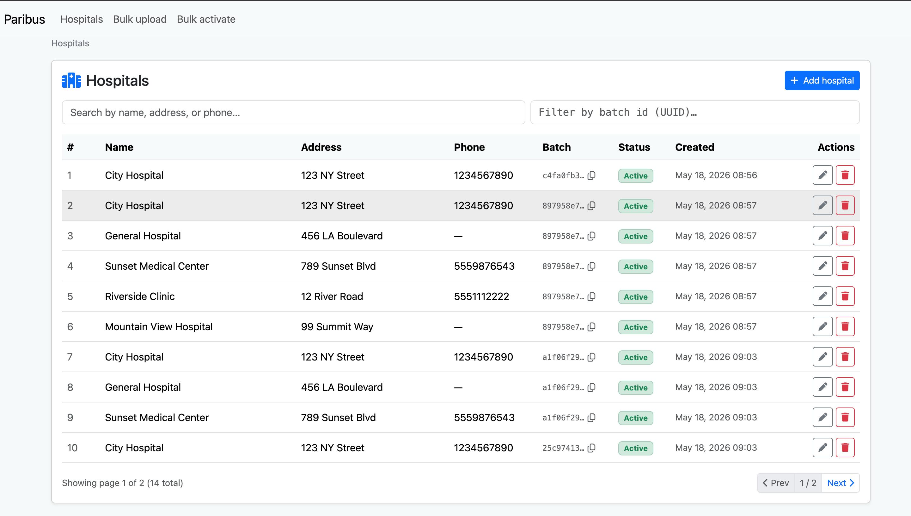
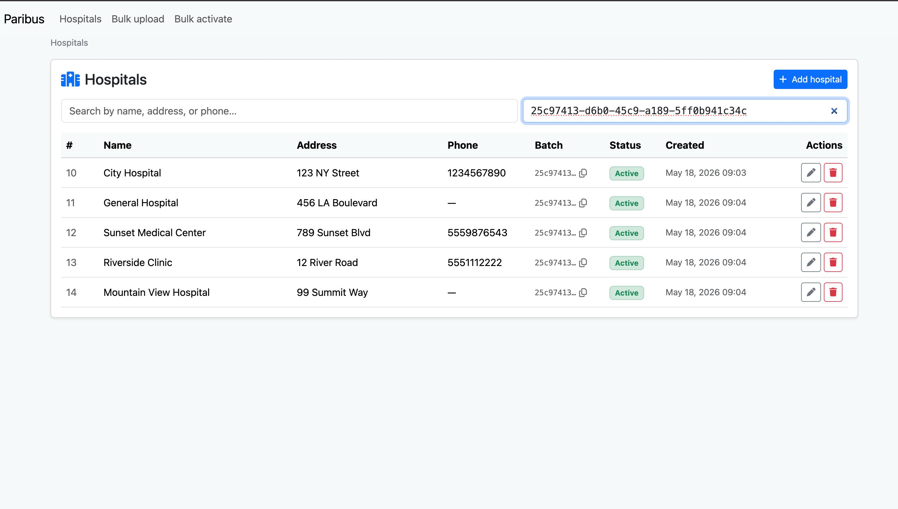
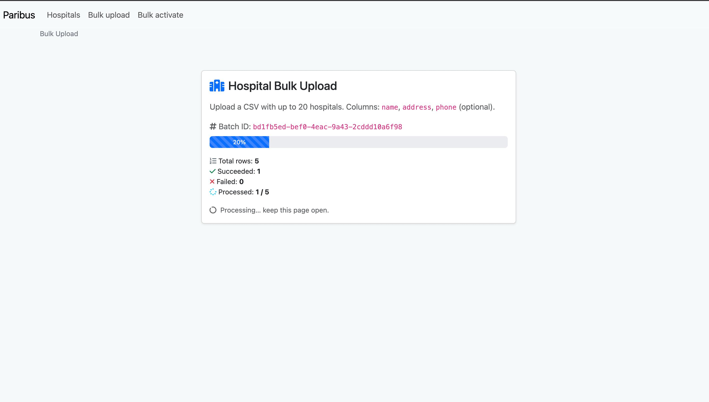
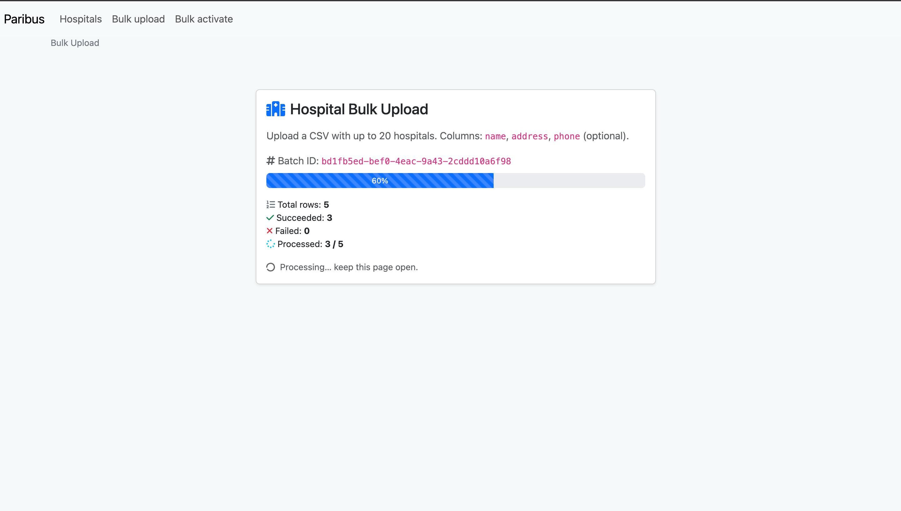
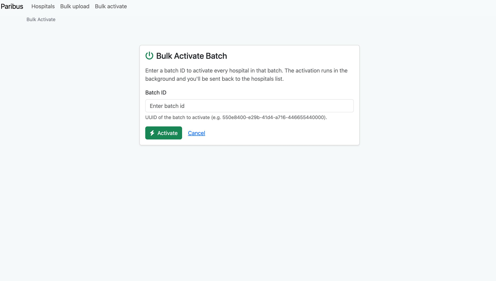

## Stack

- **Django 6** with Daphne (ASGI)
- **Channels** + **channels-redis** for WebSocket progress updates
- **Celery** for background row processing
- **Redis** as the Channels layer, Celery broker, and Django cache (batch state)
- **PostgreSQL 16** for the application database

**Why Django (not FastAPI/Flask):** the spec invites FastAPI/Flask for "minimalism", but this submission goes beyond a single bulk endpoint — it also includes a Channels-based WebSocket for live progress, a CRUD UI for hospital records, and HTMX-driven interactions. Django gives a single coherent home for ASGI + Channels + Celery + templates without bolting on a frontend stack. The bulk JSON API matches the spec's path and response shape exactly.

## Run with Docker (recommended)

```bash
docker compose up --build
```

Then open <http://localhost:8000>.

The `web` service runs migrations on startup, so the first boot is zero-config. Postgres data persists in the `postgres_data` volume across restarts.

To stop and wipe the database:

```bash
docker compose down -v
```

## JSON API (spec-compliant)

The HTML UI at `/` is a convenience layer; the assignment's required API lives under `/hospitals/bulk/`.

### `POST /hospitals/bulk/`

Submit a CSV (multipart form-data, field `file`). Returns 202 immediately with a `batch_id` — processing runs asynchronously in the Celery worker.

```bash
curl -X POST http://localhost:8000/hospitals/bulk/ \
     -F file=@sample_hospitals.csv
```

Response:

```json
{
  "batch_id": "550e8400-e29b-41d4-a716-446655440000",
  "total_hospitals": 4,
  "status": "queued",
  "status_url": "/hospitals/bulk/550e8400-e29b-41d4-a716-446655440000"
}
```

### `GET /hospitals/bulk/<batch_id>`

Poll for status. Returns the spec's response shape:

```json
{
  "batch_id": "550e8400-e29b-41d4-a716-446655440000",
  "total_hospitals": 4,
  "processed_hospitals": 4,
  "failed_hospitals": 0,
  "processing_time_seconds": 1.83,
  "batch_activated": true,
  "status": "complete",
  "error": null,
  "hospitals": [
    {"row": 1, "hospital_id": 101, "name": "City Hospital", "status": "created_and_activated", "error": null}
  ]
}
```

`status` values: `queued`, `in_progress`, `complete`. Per-row `status` values: `pending`, `created`, `created_and_activated`, `failed`.

### `POST /hospitals/bulk/validate` (bonus)

Validate a CSV without processing. Returns 200 with a preview, or 400 with validation errors.

```bash
curl -X POST http://localhost:8000/hospitals/bulk/validate -F file=@sample_hospitals.csv
```

### `POST /hospitals/bulk/<batch_id>/resume` (bonus)

Retry just the failed rows of a completed batch and re-attempt activation. Returns 202.

### Batch operations (proxies to the upstream Hospital Directory API)

Mirror the upstream paths exactly so a reviewer comparing to the spec sees one-to-one wrappers.

| Method | Path | Action |
| --- | --- | --- |
| `GET` | `/hospitals/batch/<batch_id>` | List all hospitals in the batch |
| `DELETE` | `/hospitals/batch/<batch_id>` | Delete every hospital in the batch (also clears local cached state) |
| `PATCH` | `/hospitals/batch/<batch_id>/activate` | Activate every hospital in the batch (also updates local cached state) |

```bash
# List hospitals in a batch
curl http://localhost:8000/hospitals/batch/550e8400-e29b-41d4-a716-446655440000

# Activate
curl -X PATCH http://localhost:8000/hospitals/batch/550e8400-e29b-41d4-a716-446655440000/activate

# Delete
curl -X DELETE http://localhost:8000/hospitals/batch/550e8400-e29b-41d4-a716-446655440000
```

Errors and status codes from the upstream API are propagated to the caller.

## Realtime progress UI

The HTML upload at `/` streams live progress over a WebSocket (`/ws/batch/<group>/`). Drop a CSV in the browser to watch row counters and the progress bar tick in real time — same Celery task as the JSON API, same per-row state.

## Hospital CRUD UI (extra)

`/hospitals/` is an HTMX-driven CRUD over the external Hospital Directory API: paginated table, debounced search, inline edit and delete with optimistic-feel swaps and loading indicators. Backed by the same `bulk/services/hospital_api.py` client.

## CSV format

```csv
name,address,phone
City Hospital,123 NY Street,1234567890
General Hospital,456 LA Blvd,
```

| Field | Required | Notes |
| --- | --- | --- |
| name | yes | non-empty |
| address | yes | non-empty |
| phone | no | string |

Constraints: max 20 rows per file, `.csv` extension, UTF-8 encoded, ≤ 256 KB.

## Tests

```bash
docker compose run --rm web python manage.py test bulk
```

Or locally:

```bash
python manage.py test bulk
```

Covers the CSV parser (good and bad inputs), the JSON API endpoints (upload / status / validate / 404 / 400), and the Celery task itself (happy path, partial failure, all-failed-skip-activation). External API calls and Celery dispatch are mocked, so tests run without Redis or network.

## Services

| Service | Image / build | Purpose |
| --- | --- | --- |
| `web` | local `Dockerfile` | Daphne ASGI server on :8000 |
| `worker` | local `Dockerfile` | Celery worker running `bulk.process_batch` |
| `db` | `postgres:16-alpine` | Application database |
| `redis` | `redis:7-alpine` | Channels layer + Celery broker/result backend + Django cache |

## Environment variables

| Variable | Default (local) |
| --- | --- |
| `DB_HOST` | `127.0.0.1` |
| `DB_PORT` | `5432` |
| `DB_NAME` | `paribus` |
| `DB_USER` | `postgres` |
| `DB_PASSWORD` | `root` |
| `REDIS_HOST` | `127.0.0.1` |
| `REDIS_PORT` | `6379` |

`docker-compose.yml` overrides the host vars to the service names.

## Run locally without Docker

```bash
uv venv # use astral uv for better performance
source .venv/bin/activate
uv pip install -r requirements.txt

# Start Postgres on :5432 and Redis on :6379 yourself, then:
python manage.py migrate
celery -A paribus worker -l info   # terminal 1
python manage.py runserver         # terminal 2
```

## Project layout

```
paribus/                Django project (settings, ASGI, routing, Celery app)
bulk/                   Bulk-upload app
  views.py              HTML upload view (unchanged from the original UI)
  api_views.py          JSON API: upload / status / validate / resume
  api_urls.py           URLconf for /hospitals/bulk/*
  tasks.py              Celery task: process_batch, retry_failed_rows
  consumers.py          Channels consumer for live progress
  services/hospital_api.py   External Hospital Directory API client (requests)
  services/csv_parser.py     CSV validation and parsing
  tests.py              Unit + integration tests
hospital_management/    HTMX CRUD UI over the external API
common/                 Shared base views / mixins
utils/                  Utility helpers (pagination, etc.)
```

WebSocket route: `ws/batch/<batch_id>/` → [`BatchProgressConsumer`](bulk/consumers.py).
Celery tasks: [`bulk.process_batch`](bulk/tasks.py), [`bulk.retry_failed_rows`](bulk/tasks.py).

## Realtime progress UI

The HTML upload at `/` streams live progress over a WebSocket (`/ws/batch/<group>/`). Drop a CSV in the browser to watch row counters and the progress bar tick in real time — same Celery task as the JSON API, same per-row state.





